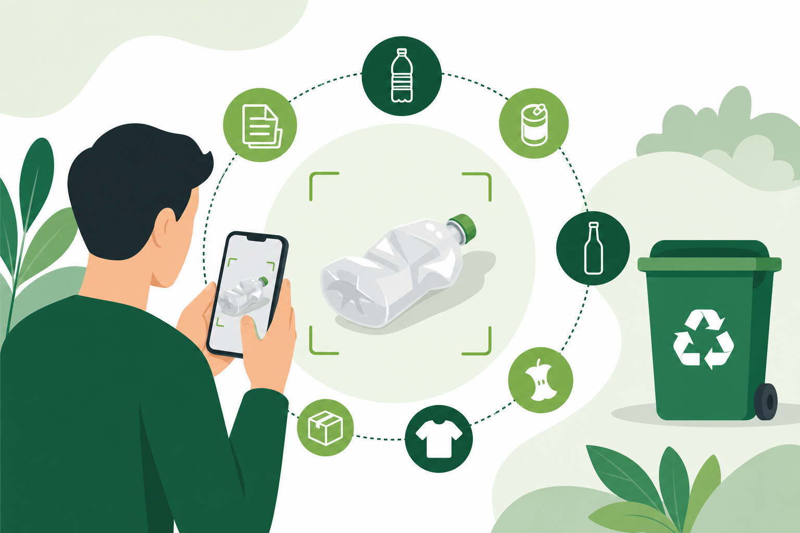
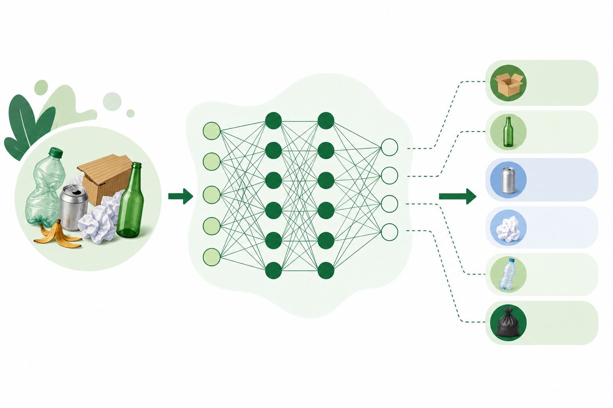

# Rapport Professionnel - WasteSort AI

## 1. Introduction

Le tri des déchets est un enjeu important pour la protection de l'environnement. Dans la vie quotidienne, il n'est pas toujours évident de savoir si un objet doit être placé dans la catégorie du carton, du verre, du métal, du papier, du plastique ou dans les déchets non recyclables. Une mauvaise classification peut réduire l'efficacité du recyclage et compliquer le travail de traitement des déchets.

Avec les progrès de l'intelligence artificielle, il devient possible d'utiliser la reconnaissance d'images pour aider à identifier automatiquement certains objets. Le projet **WasteSort AI** s'inscrit dans cette logique. Il s'agit d'une application web capable d'analyser une photo de déchet et de proposer une catégorie de tri.

Le projet combine plusieurs éléments : un modèle de Deep Learning, une interface web simple, un système de confiance, et une présentation visuelle adaptée à un public non technique. L'objectif n'est pas de remplacer totalement le jugement humain, mais de proposer une aide claire et rapide à la décision.



**Figure 1 :** exemple d'utilisation de WasteSort AI. L'utilisateur prend une photo d'un déchet, puis l'application propose une catégorie de tri.

## 2. Problématique

La problématique principale du projet est la suivante :

**Comment utiliser le Deep Learning pour reconnaître automatiquement le type de déchet à partir d'une image et aider l'utilisateur à mieux trier ?**

Cette problématique repose sur plusieurs difficultés. Les déchets peuvent avoir des formes, couleurs et textures très différentes. À l'inverse, certaines catégories peuvent se ressembler : par exemple, un emballage plastique peut ressembler à du papier selon la photo, et certains déchets non recyclables peuvent être visuellement proches d'objets recyclables.

Il faut donc créer un système capable d'apprendre à partir d'images, mais aussi capable d'indiquer quand il n'est pas assez sûr de sa réponse.

## 3. Objectifs Du Projet

Le projet WasteSort AI a plusieurs objectifs :

- classifier une image de déchet parmi six catégories ;
- proposer une interface simple utilisable par un public non technique ;
- afficher un pourcentage de confiance pour chaque prédiction ;
- afficher les probabilités par classe ;
- ajouter un statut de fiabilité pour éviter de valider une prédiction trop incertaine ;
- utiliser un modèle moderne de reconnaissance d'images basé sur le Transfer Learning ;
- produire un projet présentable dans un cadre académique ou professionnel.

Les six classes reconnues par le système sont :

| Classe anglaise | Label français |
| --- | --- |
| cardboard | Carton |
| glass | Verre |
| metal | Métal |
| paper | Papier |
| plastic | Plastique |
| trash | Déchet non recyclable |

## 4. Dataset

Le projet utilise le dataset **Garbage Classification**, disponible sur Kaggle. Ce dataset contient des images de déchets réparties en plusieurs dossiers, chaque dossier correspondant à une classe.

La structure attendue du dataset est la suivante :

```text
data/garbage/
├── cardboard/
├── glass/
├── metal/
├── paper/
├── plastic/
└── trash/
```

Dans le projet, le dataset a été utilisé pour l'entraînement et la validation du modèle. Une partie des images est utilisée pour apprendre au modèle à reconnaître les catégories, et une autre partie est utilisée pour mesurer sa performance sur des images qu'il n'a pas directement vues pendant l'entraînement.

Le dataset est adapté à un projet de démonstration, mais il reste limité par rapport à une utilisation réelle. Dans la réalité, les photos peuvent être prises avec des angles différents, des fonds complexes, une mauvaise lumière ou plusieurs objets visibles en même temps.


**Figure 2 :** représentation visuelle des six catégories reconnues par le système : carton, verre, métal, papier, plastique et déchet non recyclable.

## 5. Prétraitement Des Images

Avant d'être données au modèle, les images doivent être préparées. Le prétraitement permet de rendre toutes les images compatibles avec l'architecture du modèle.

Pour le modèle MobileNetV2, les images sont redimensionnées en **224 x 224 pixels**. Un prétraitement spécifique à MobileNetV2 est ensuite appliqué afin de respecter le format attendu par le modèle.

Une data augmentation est également utilisée pendant l'entraînement. Elle permet de créer artificiellement de légères variations des images pour rendre le modèle plus robuste.

Les transformations utilisées incluent :

- rotation légère ;
- zoom ;
- déplacement horizontal ;
- déplacement vertical ;
- retournement horizontal ;
- variation de luminosité ;
- variation de contraste.

L'objectif est de faire apprendre au modèle que le même objet peut apparaître sous plusieurs formes selon la photo.

## 6. Méthodologie

La méthodologie du projet se déroule en plusieurs étapes.

Tout d'abord, les images sont organisées par classes dans le dossier du dataset. Ensuite, les générateurs d'images créent automatiquement les lots d'entraînement et de validation. Les images sont prétraitées et augmentées pour améliorer la généralisation du modèle.

Le premier modèle testé était un CNN simple, composé de couches de convolution, de pooling, de couches denses et d'une couche finale Softmax. Ce modèle a permis de valider le pipeline, mais sa fiabilité était limitée sur des photos réelles.

Pour améliorer les performances, le projet utilise ensuite une approche de **Transfer Learning** avec **MobileNetV2**. Cette méthode consiste à réutiliser un modèle déjà entraîné sur un grand nombre d'images, puis à l'adapter au problème spécifique du tri des déchets.

Cette approche est plus performante qu'un CNN simple, car MobileNetV2 possède déjà une bonne capacité à reconnaître des formes, textures et objets visuels.

### Diagramme De Fonctionnement

```text
Photo utilisateur
       ↓
Prétraitement de l'image
       ↓
MobileNetV2
       ↓
Calcul des probabilités
       ↓
Classe prédite + confiance
       ↓
Statut de fiabilité
```

Ce diagramme résume le fonctionnement général de l'application. L'image envoyée par l'utilisateur est d'abord préparée, puis analysée par le modèle. Le système calcule ensuite les probabilités pour chaque classe et affiche un résultat compréhensible.

## 7. Architecture Du Modèle

Le modèle principal utilisé dans WasteSort AI est **MobileNetV2**.

MobileNetV2 est une architecture de réseau de neurones convolutionnel conçue pour être légère et rapide. Elle est particulièrement adaptée aux applications web ou mobiles, car elle offre un bon compromis entre performance et rapidité.

Dans ce projet, MobileNetV2 est utilisé sans sa couche de classification originale. Une nouvelle tête de classification est ajoutée pour reconnaître les six catégories du projet.

L'architecture générale est la suivante :

1. Image d'entrée en 224 x 224 pixels.
2. Extraction des caractéristiques visuelles avec MobileNetV2.
3. Couche `GlobalAveragePooling2D`.
4. Couche dense avec activation ReLU.
5. Couche Dropout pour limiter le surapprentissage.
6. Couche finale Softmax avec six sorties.

La couche Softmax produit une probabilité pour chaque classe. La classe avec la probabilité la plus élevée devient la prédiction proposée par l'application.



**Figure 3 :** représentation simplifiée du modèle : une image entre dans le réseau de neurones, puis le modèle produit une prédiction parmi les classes disponibles.

### Schéma Simplifié De L'Architecture

| Étape | Rôle |
| --- | --- |
| Image 224 x 224 | Format d'entrée du modèle |
| MobileNetV2 | Extraction des caractéristiques visuelles |
| GlobalAveragePooling2D | Réduction des cartes de caractéristiques |
| Dense + ReLU | Apprentissage des relations entre caractéristiques |
| Dropout | Réduction du surapprentissage |
| Softmax | Probabilités finales par classe |

## 8. Entraînement

L'entraînement est réalisé avec TensorFlow et Keras.

Le modèle utilise :

- optimiseur : Adam ;
- fonction de perte : categorical crossentropy ;
- métrique principale : accuracy ;
- arrêt anticipé : EarlyStopping ;
- réduction automatique du taux d'apprentissage : ReduceLROnPlateau.

L'entraînement se fait en deux phases.

Dans la première phase, la base MobileNetV2 est gelée. Seules les nouvelles couches ajoutées à la fin du modèle sont entraînées. Cela permet au modèle d'apprendre rapidement à associer les caractéristiques visuelles aux classes de déchets.

Dans la deuxième phase, certaines dernières couches de MobileNetV2 sont dégelées pour réaliser un fine-tuning. Cette étape permet d'adapter plus finement le modèle au dataset des déchets.

### Diagramme D'Entraînement

```text
Dataset Kaggle
       ↓
Séparation entraînement / validation
       ↓
Data augmentation
       ↓
Phase 1 : entraînement de la tête du modèle
       ↓
Phase 2 : fine-tuning de MobileNetV2
       ↓
Évaluation finale
```

Cette organisation permet d'abord d'apprendre rapidement les nouvelles classes, puis d'ajuster progressivement une partie du modèle pré-entraîné pour améliorer les résultats.

## 9. Interface Utilisateur

L'application web est développée avec **Streamlit**. Elle a été pensée pour être simple et claire.

L'utilisateur peut :

- importer une image depuis son ordinateur ;
- prendre une photo avec la caméra ;
- lancer automatiquement l'analyse ;
- consulter la catégorie proposée ;
- voir le pourcentage de confiance ;
- voir les probabilités pour chaque classe ;
- obtenir un statut de fiabilité.

Les statuts de fiabilité sont :

- **Très fiable** ;
- **Fiable** ;
- **À vérifier** ;
- **Incertain**.

Ce système permet d'éviter de présenter une prédiction comme certaine lorsque le modèle hésite. Si la confiance ou l'écart avec la deuxième classe est faible, l'application indique que la photo doit être vérifiée.

### Parcours Utilisateur

| Étape | Action utilisateur | Réponse de l'application |
| --- | --- | --- |
| 1 | Importer ou prendre une photo | L'image est affichée dans l'interface |
| 2 | Attendre l'analyse | Le modèle calcule les probabilités |
| 3 | Lire le résultat | La classe proposée et la confiance sont affichées |
| 4 | Vérifier le statut | L'application indique si le résultat est fiable |

## 10. Résultats

Le modèle MobileNetV2 atteint environ **81,5 % d'accuracy en validation**.

Ce résultat est satisfaisant pour un projet de démonstration. Il montre que le modèle est capable de reconnaître plusieurs catégories de déchets avec une précision correcte.

Les classes comme le carton, le verre et le métal sont généralement mieux reconnues. Les classes plus difficiles sont le plastique, le papier et les déchets non recyclables. Ces classes peuvent se ressembler selon la forme, la couleur ou la qualité de l'image.

Le projet inclut également un mécanisme de prédiction renforcée. Au lieu d'analyser une seule version de l'image, l'application peut analyser plusieurs variantes légères de la même image, puis moyenner les résultats. Cela rend la prédiction plus stable face aux variations de cadrage et de luminosité.

### Synthèse Des Résultats

| Élément évalué | Résultat |
| --- | --- |
| Modèle principal | MobileNetV2 |
| Méthode | Transfer Learning + fine-tuning |
| Accuracy validation | Environ 81,5 % |
| Classes généralement plus stables | Carton, verre, métal |
| Classes plus difficiles | Plastique, papier, trash |
| Sécurité ajoutée | Statut de fiabilité et prédiction renforcée |

## 11. Limites

Le projet présente plusieurs limites.

Premièrement, la qualité de la photo influence fortement le résultat. Une image floue, sombre, mal cadrée ou contenant plusieurs déchets peut réduire la fiabilité.

Deuxièmement, certaines classes sont naturellement ambiguës. Par exemple, un emballage plastique blanc peut ressembler à du papier. De même, certains déchets non recyclables peuvent avoir une apparence proche du plastique ou du métal.

Troisièmement, le dataset utilisé reste limité. Pour une application professionnelle, il faudrait entraîner le modèle sur davantage d'images réelles, prises dans des environnements variés.

Enfin, le modèle ne connaît que les six catégories prévues. Si l'utilisateur envoie une image qui ne correspond pas vraiment à un déchet, le modèle essaiera tout de même de la classer dans l'une des catégories connues.

## 12. Améliorations Possibles

Plusieurs améliorations peuvent être envisagées :

- ajouter plus d'images au dataset ;
- collecter des photos prises dans des conditions réelles ;
- améliorer les classes difficiles comme plastique, papier et trash ;
- tester d'autres modèles comme EfficientNet ;
- ajouter une classe "objet inconnu" ;
- créer une application mobile ;
- améliorer l'expérience utilisateur avec des conseils personnalisés ;
- ajouter une base de règles de tri selon les consignes locales.

Une amélioration importante serait d'entraîner le modèle sur des images prises directement avec un téléphone, car c'est le cas d'usage le plus proche de l'application réelle.

## 13. Conclusion

WasteSort AI est un projet de Deep Learning appliqué à un problème concret : l'aide au tri des déchets. Il combine reconnaissance d'images, Transfer Learning, interface web et indicateur de fiabilité.

Le projet montre comment l'intelligence artificielle peut être utilisée pour créer un outil simple et utile. Même si le modèle n'est pas parfait, il permet de démontrer une démarche complète : préparation des données, entraînement du modèle, évaluation, création d'une interface et prise en compte des limites.

WasteSort AI constitue donc un projet pertinent pour un portfolio, une présentation académique ou une démonstration d'intelligence artificielle appliquée à l'environnement.
