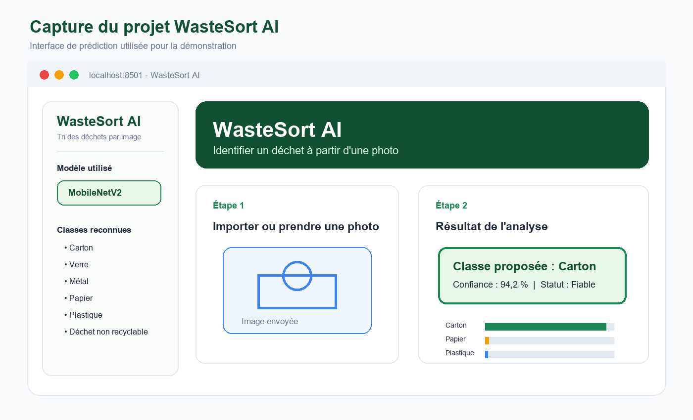
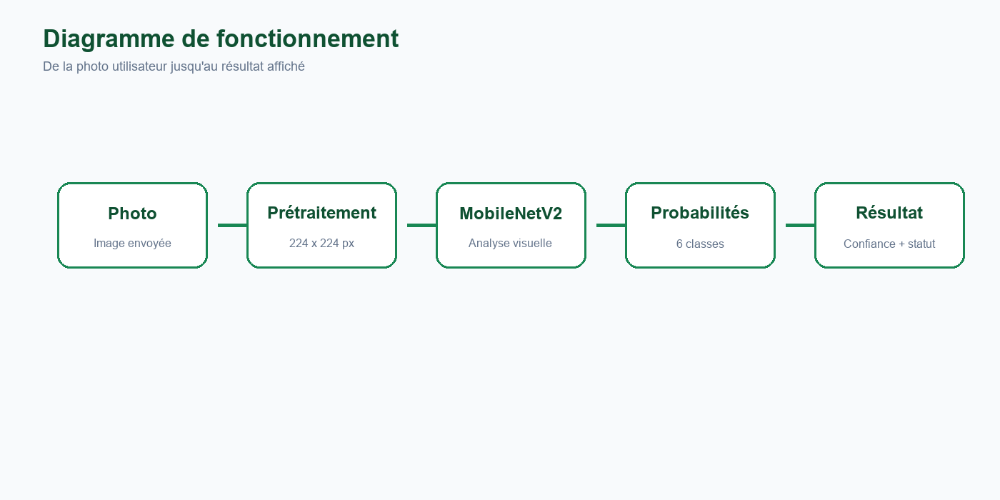
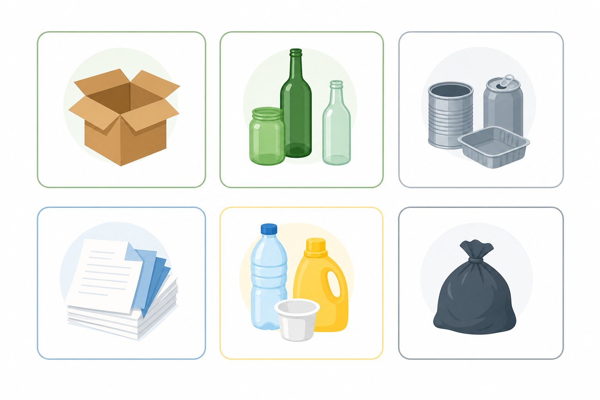
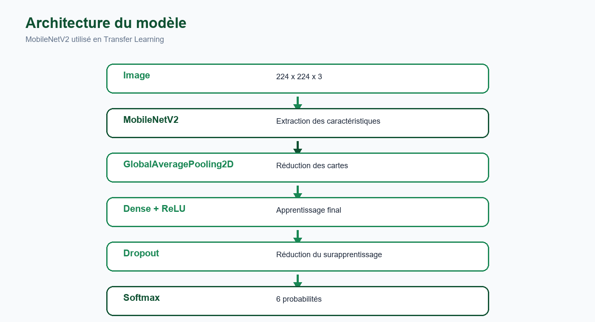
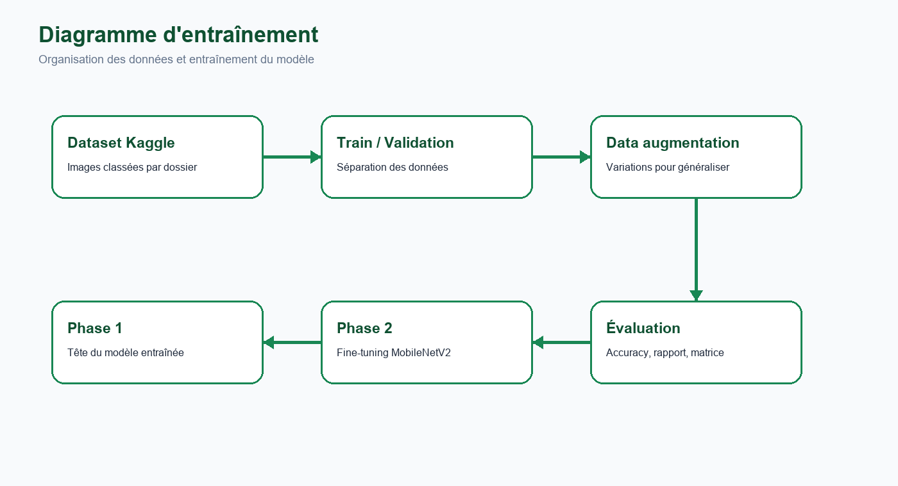
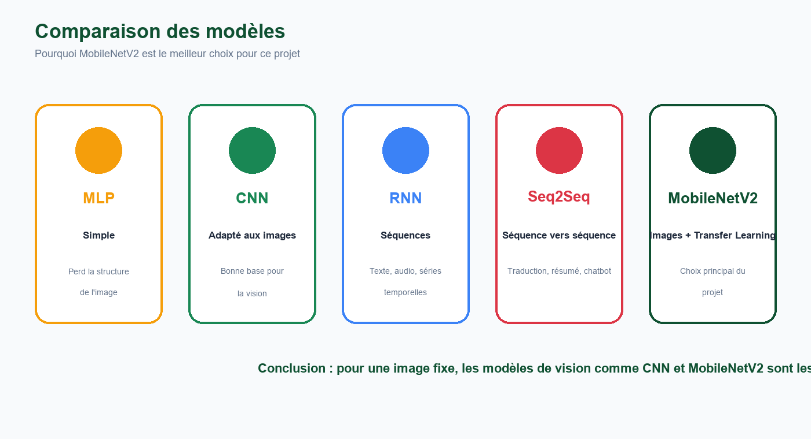
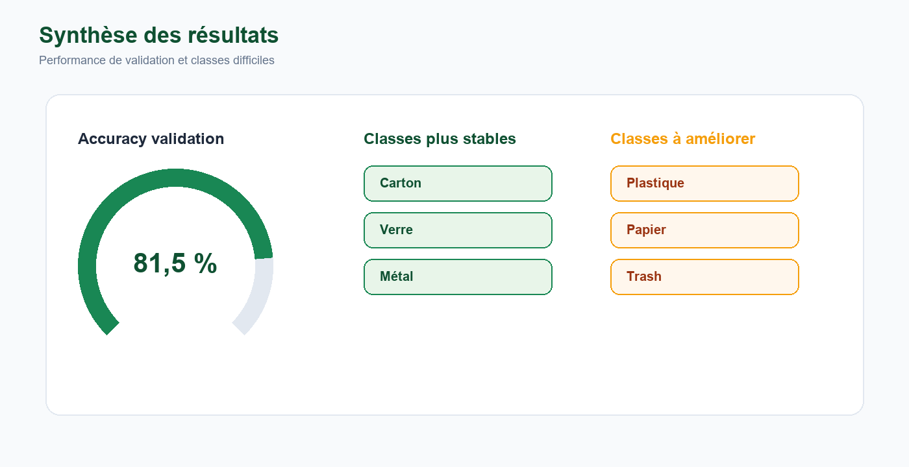

# Rapport Professionnel - WasteSort AI Suite

## Page De Garde

**Titre du projet :** WasteSort AI Suite  
**Sujet :** Plateforme IA multi-modèles pour le tri et l'écologie  
**Nom de l'étudiant :** ......  
**Nom de la prof :** ......  
**Classe / formation :** ......  
**Établissement :** EMSI / ......  
**Année scolaire :** ......  
**Technologies principales :** Python, TensorFlow/Keras, Streamlit, MobileNetV2, MLP, LSTM, Seq2Seq


## 1. Introduction

Le projet **WasteSort AI Suite** est une plateforme intelligente qui regroupe plusieurs modèles d'intelligence artificielle autour d'un même thème : l'écologie et la gestion intelligente d'un campus.

La première version du projet était centrée sur la reconnaissance automatique des déchets à partir d'une image. Cette version a ensuite été étendue pour devenir une plateforme plus complète, capable de démontrer plusieurs familles de modèles : **CNN/MobileNetV2**, **MLP**, **RNN/LSTM** et **Seq2Seq**.

L'objectif est de montrer qu'un même projet peut intégrer plusieurs types de données :

- des images ;
- des données tabulaires ;
- des séries temporelles ;
- du texte ou des questions utilisateur.

Cette approche rend le projet plus riche et plus intéressant à présenter, car chaque module correspond à un usage concret de l'intelligence artificielle.



**Figure 1 :** capture représentative de l'interface. L'application regroupe plusieurs modules dans une interface Streamlit simple à utiliser.

## 2. Problématique

La problématique générale du projet est la suivante :

**Comment regrouper plusieurs modèles d'intelligence artificielle dans une seule plateforme afin d'aider un campus à mieux gérer le tri, l'énergie, le score écologique et les questions des utilisateurs ?**

Cette problématique se divise en plusieurs sous-problèmes :

- reconnaître automatiquement un déchet à partir d'une image ;
- calculer un score écologique à partir de données simples ;
- prévoir une consommation énergétique à partir d'un historique ;
- répondre aux questions des utilisateurs sur le tri ;
- rendre tous ces modules accessibles dans une interface web.

## 3. Objectifs Du Projet

Les objectifs principaux sont :

- créer une plateforme web claire et facile à utiliser ;
- intégrer plusieurs modèles d'IA dans un même projet ;
- expliquer le rôle de chaque modèle ;
- garder le module de reconnaissance de déchets basé sur MobileNetV2 ;
- ajouter un module MLP pour un score écologique ;
- ajouter un module RNN/LSTM pour une prévision énergétique ;
- ajouter un assistant de tri basé sur une logique Seq2Seq/FAQ ;
- produire un rapport et une présentation adaptés à un jury.

## 4. Vue D'Ensemble De La Plateforme

WasteSort AI Suite est organisée en cinq parties :

| Module | Type de modèle | Type de données | Rôle |
| --- | --- | --- | --- |
| Reconnaissance des déchets | CNN / MobileNetV2 | Image | Identifier le type de déchet |
| Score écologique | MLP | Données tabulaires | Calculer un score sur 100 |
| Prévision énergie | RNN / LSTM | Série temporelle | Prévoir une consommation future |
| Assistant de tri | Seq2Seq / FAQ | Texte | Répondre aux questions |
| Dashboard Streamlit | Interface web | Tous types | Regrouper les modules |



**Figure 2 :** fonctionnement général : l'utilisateur interagit avec l'interface, puis le module adapté traite la donnée envoyée.

## 5. Module Image - CNN Et MobileNetV2

Le module de reconnaissance des déchets est le cœur historique du projet WasteSort AI. Il permet à l'utilisateur d'envoyer une photo ou de prendre une image avec la caméra. Le modèle analyse ensuite l'image et propose une catégorie de tri.

Les classes reconnues sont :

| Classe anglaise | Label français |
| --- | --- |
| cardboard | Carton |
| glass | Verre |
| metal | Métal |
| paper | Papier |
| plastic | Plastique |
| trash | Déchet non recyclable |



**Figure 3 :** catégories principales reconnues par le modèle de classification d'images.

### Pourquoi CNN ?

Un CNN est adapté aux images parce qu'il conserve la structure spatiale des pixels. Il détecte progressivement des formes simples, puis des formes plus complexes.

### Pourquoi MobileNetV2 ?

MobileNetV2 est un CNN pré-entraîné. Grâce au **Transfer Learning**, il permet d'obtenir de meilleurs résultats qu'un CNN simple avec moins de données et moins de temps d'entraînement.



**Figure 4 :** architecture simplifiée du modèle MobileNetV2 utilisé pour la classification des déchets.

## 6. Module MLP - Score Écologique

Le module MLP illustre l'utilisation d'un réseau de neurones sur des données tabulaires.

Les entrées utilisées sont :

- nombre de déchets correctement triés ;
- consommation électrique ;
- consommation d'eau ;
- participation aux actions écologiques ;
- score de transport durable.

La sortie du module est un **score écologique sur 100**, accompagné d'un label :

- Excellent ;
- Bon ;
- Moyen ;
- À améliorer.

Dans une version complète, ce module pourrait être entraîné sur un vrai dataset d'étudiants, de bâtiments ou de comportements écologiques. Dans cette version, il fonctionne comme un prototype explicable, utile pour présenter le principe d'un MLP.

## 7. Module RNN / LSTM - Prévision Énergie

Le module RNN/LSTM montre comment traiter des données séquentielles.

Une consommation d'énergie est une série temporelle : chaque valeur dépend souvent des jours précédents. Un LSTM est donc plus adapté qu'un MLP pour ce type de problème, car il peut apprendre une évolution dans le temps.

Le module prend un historique de consommation, par exemple :

```text
120, 128, 125, 132, 140, 137, 145
```

Il produit ensuite une prévision pour les prochains jours.



**Figure 5 :** logique générale d'entraînement et d'évaluation d'un modèle dans le projet.

## 8. Module Seq2Seq - Assistant De Tri

Le module Seq2Seq représente la partie texte du projet.

Un modèle Seq2Seq est généralement utilisé lorsque l'entrée et la sortie sont des séquences, par exemple :

- traduction automatique ;
- résumé de texte ;
- chatbot ;
- génération de réponses.

Dans WasteSort AI Suite, le module agit comme un assistant de tri. L'utilisateur peut poser une question comme :

```text
Où jeter une bouteille plastique ?
```

L'assistant répond avec une explication simple. Dans la version actuelle, le module utilise une base FAQ fiable pour la démonstration. Une version avancée pourrait utiliser un vrai modèle Seq2Seq entraîné.

## 9. Comparaison Des Modèles

Chaque modèle du projet correspond à un type de donnée différent.

| Modèle | Données adaptées | Exemple dans le projet |
| --- | --- | --- |
| MLP | Tableaux, valeurs numériques | Score écologique |
| CNN | Images | Classification des déchets |
| MobileNetV2 | Images avec Transfer Learning | Reconnaissance plus fiable |
| RNN / LSTM | Séries temporelles | Prévision énergie |
| Seq2Seq | Texte, séquences | Assistant de tri |



**Figure 6 :** comparaison visuelle des modèles étudiés dans WasteSort AI Suite.

Le projet montre donc que le choix du modèle dépend du type de donnée. Pour les images, MobileNetV2 est le meilleur choix. Pour les données tabulaires, un MLP est plus adapté. Pour les séries temporelles, on utilise plutôt un LSTM. Pour le texte et les questions, une logique Seq2Seq est plus pertinente.

## 10. Interface Utilisateur

L'interface est développée avec **Streamlit**. Elle regroupe tous les modules dans une navigation simple :

- Accueil ;
- Déchets - CNN/MobileNetV2 ;
- Score écologique - MLP ;
- Prévision énergie - LSTM ;
- Assistant tri - Seq2Seq ;
- Comparaison des modèles.

L'objectif de cette interface est de permettre à un public non technique de tester les différents modules sans écrire de code.

## 11. Résultats

Le module image basé sur MobileNetV2 atteint environ **81,5 % d'accuracy en validation**. Ce résultat est satisfaisant pour une démonstration académique.

Les autres modules sont des prototypes fonctionnels :

- le module MLP produit un score écologique cohérent ;
- le module LSTM simule une prévision à partir d'un historique ;
- le module Seq2Seq/FAQ répond à des questions simples sur le tri.



**Figure 7 :** synthèse visuelle des résultats du module de reconnaissance des déchets.

## 12. Limites

Le projet a plusieurs limites :

- les modules MLP, LSTM et Seq2Seq sont des prototypes de démonstration ;
- ils ne remplacent pas encore des modèles entraînés sur de grands datasets ;
- le module image dépend fortement de la qualité de la photo ;
- certaines classes de déchets se ressemblent visuellement ;
- le modèle ne reconnaît que les classes prévues.

Ces limites sont importantes à présenter, car elles montrent que le projet reste réaliste et que les résultats doivent être interprétés avec prudence.

## 13. Améliorations Possibles

Plusieurs améliorations peuvent être envisagées :

- entraîner un vrai MLP sur un dataset de comportements écologiques ;
- entraîner un vrai LSTM sur des données réelles de consommation ;
- créer un vrai chatbot Seq2Seq ou Transformer ;
- ajouter une classe "objet inconnu" ;
- ajouter plus d'images réelles pour la reconnaissance des déchets ;
- créer une application mobile ;
- connecter la plateforme à une base de données.

## 14. Conclusion

WasteSort AI Suite est une plateforme complète qui regroupe plusieurs modèles d'intelligence artificielle dans un même projet.

Le projet montre la différence entre plusieurs familles de modèles :

- MLP pour les données tabulaires ;
- CNN/MobileNetV2 pour les images ;
- RNN/LSTM pour les séries temporelles ;
- Seq2Seq pour les textes et les questions.

Cette évolution rend le projet plus complet, plus pédagogique et plus intéressant à présenter devant un jury. Il ne s'agit plus seulement d'une application de classification de déchets, mais d'une plateforme IA multi-modèles autour de l'écologie et du campus intelligent.
